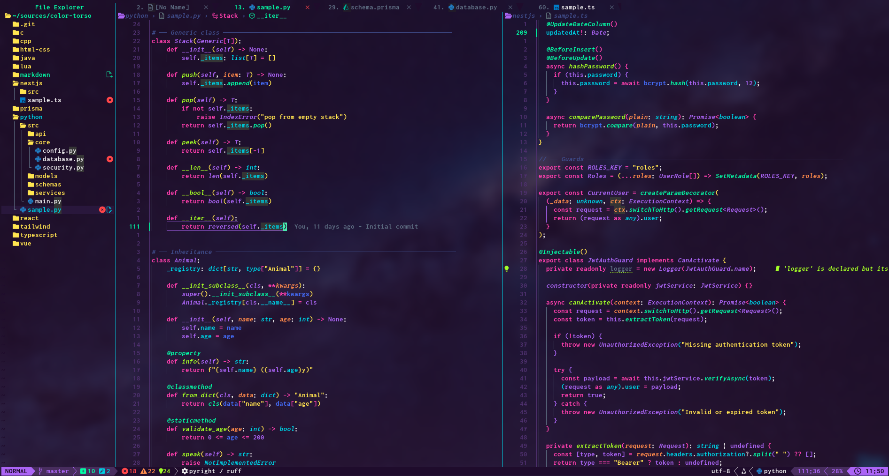

<div align="center">
  <h1>voltwave</h1>
</div>

Inspired by Synthwave84 and [Fluoromachine](https://github.com/maxmx03/fluoromachine.nvim), this Neovim color theme features a retro-futuristic vibe with a touch of “green electricity”—a personal touch I added to suit my own taste.



## Requirements

- Neovim 0.10+
- `termguicolors` (enabled automatically)

## Installation

### lazy.nvim

```lua
{
  'shirokuroiori/voltwave.nvim',
  lazy = false,
  priority = 1000,
  config = function()
    require('voltwave').setup({})
    vim.cmd.colorscheme('voltwave')
  end,
}
```

### packer.nvim

```lua
use {
  'shirokuroiori/voltwave.nvim',
  config = function()
    require('voltwave').setup({})
    vim.cmd.colorscheme('voltwave')
  end,
}
```

## Minimal Configuration

```lua
require('voltwave').setup({})
vim.cmd.colorscheme('voltwave')
```

## Full Configuration

```lua
require('voltwave').setup({
  transparent = false,        -- true: Normal/NormalNC/SignColumn etc. bg = NONE
  bolt = true,                -- 稲妻ライム緑 (#B6FF00) を MatchParen, LSP Hint, TODO コメントで使う (default: true)
  glow = true,                -- fluoromachine 風の淡いネオングローを主要グループへ付与 (default: true)
  glow_strength = 1.0,        -- グロー強度倍率。0.0 で無効、1.0 で標準 (default: 1.0)
  italic = {
    comments   = true,
    keywords   = false,
    functions  = false,
    variables  = false,
    types      = true,
    parameters = true,
    booleans   = false,
  },
  bold = {
    functions = false,
    keywords  = false,
  },
  plugins = {
    cmp              = true,
    telescope        = true,
    neo_tree         = true,
    bufferline       = true,
    indent_blankline = true,
    gitsigns         = true,
    which_key        = true,
    lazygit          = true,
    render_markdown    = true,
    rainbow_delimiters = true,
  },
  -- Override any highlight group
  overrides = {
    -- Example: make Normal background slightly lighter
    -- Normal = { fg = '#c0c4bb', bg = '#1a1726' },
  },
})
vim.cmd.colorscheme('voltwave')
```

This lightning effect is inspired by the name “voltwave.” Setting `bolt = false` uses the fallback color (`green`).
Setting `glow = false` disables the glow background, resulting in a flat appearance.
We recommend setting `glow_strength` within the range of `0.0–1.0` (values outside this range will be clamped internally).

## LazyGit

The outer border of the LazyGit float window is controlled by `LazyGitBorder` (set to cyan by voltwave).
Inner panel borders are rendered by LazyGit itself and must be configured in `~/.config/lazygit/config.yml`:

```yaml
gui:
  theme:
    activeBorderColor:
      - '#B6FF00'
      - bold
    inactiveBorderColor:
      - '#03E1FF'
    searchingActiveBorderColor:
      - '#B6FF00'
      - bold
```

This matches the voltwave palette: `green_bolt` (#B6FF00) for active panels, `cyan` (#03E1FF) for inactive panels.

## lualine

```lua
require('lualine').setup {
  options = {
    theme = require('voltwave.extras.lualine').get(),
  },
}
```

## Palette

[Palette](./lua/voltwave/palette.lua)

## License

[MIT License](./LICENSE)
